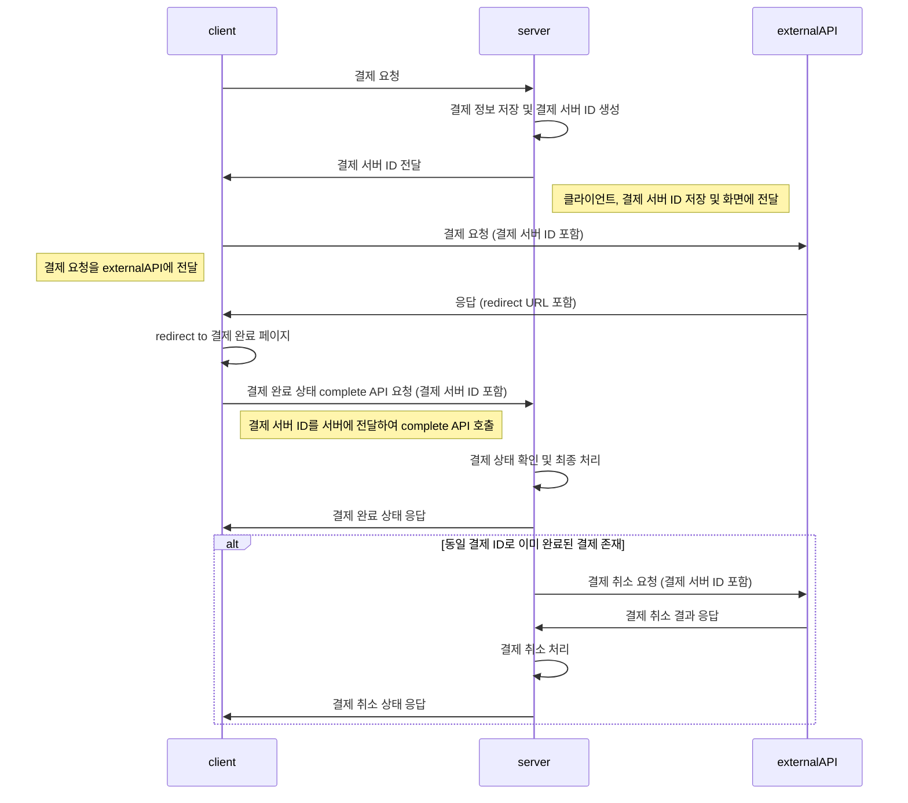

# 프레임워크 및 라이브러리 설정 
- 언어 : GoLang
- 프레임워크 : Gin
- 라이브러리 
  - viper : 설정파일
  - swaggo : API 문서화
  - testify : 테스트
  - uber_fx : DI
## API 고려 사항 
- 결제 상태 확인을 위해 client가 외부 API 호출 전 요청을 서버에 저장
- 해당 결제 서버 ID를 화면에 넘겨주고 client는 해당 ID로 외부 결제 API에 요청
- 클라이언트는 redirect를 하고 나서 결제 상태를 확인하기 위해 서버에 해당 ID로 요청 ( complete API 이용)
- 동일 결제 ID에 대해서 이미 완료가 된 결제라면 해당 요청에 대해 서버에서 외부 api 에 대해 해당 결제 취소 요청

# 프론트엔드 설정
- 언어 : TypeScript
- 프레임워크 : Vue
